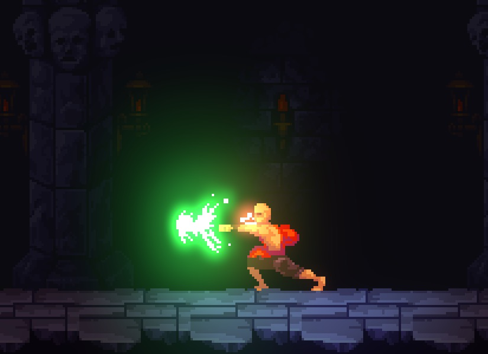
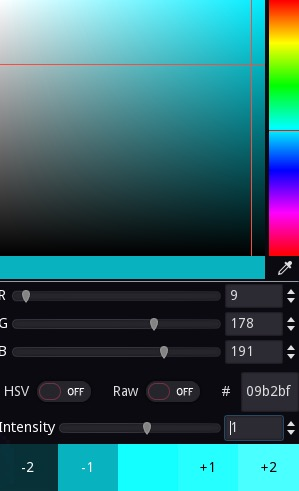

# Godot 2D Glow demo
this repository is a godot port of [Brackeys Unity 2D GLOW tutorial](https://www.youtube.com/watch?v=WiDVoj5VQ4c).

You can make part of sprite glow,and change the glow color at runtime.

There is also a better(I think) hdr color picker in this repository:

## Credits
- The main idea comes from [Brackeys](https://www.youtube.com/c/Brackeys).

- The sprites is created by [ansimuz](https://opengameart.org/content/gothicvania-church-pack).

- Some of the code in hdr_color_picker.gd is from [UnityCsReference](https://github.com/Unity-Technologies/UnityCsReference/blob/master/Editor/Mono/GUI/ColorMutator.cs).